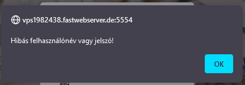

Teszt dokumentáció
==================

A __SocketChat__ alkalmazás tesztelése két fő szempont szerint történt:

1. Megjelenés

        1/a. Böngésző méretezésekor a tartalom igazodik.

        1/b. A chat felület témája megfelelően változik.

        1/c. A szobában látható a bent lévő felhasználók listája.

2. Funkciók

        2/a. Több felhasználó regisztrálása.

        2/b. Több felhasználó beléptetése.

        2/c. Szoba létrehozása.

        2/d. Üzenet küldése a szoba nyelvén.

        2/e. Szoba törlése.

        2/f. Belépés külső fiókkal.

A teszteléshez használt böngésző: __Firefox__.

## 1/a.

    A méretezés helyességének vizsgálatához négy ablakban nyitottuk meg az appot. Ahogy a képen látszik, valamennyi tartalma helyesen jelent meg, a kicsinyítés ellenére is.

    Kicsinítés nélkül sem tolódik el a háttérkép, és a bejelentkezési panel.

    Ez igaz a chat szoba kezelő, és a chat felületre is.

## 1/b.

    Az alapértelmezett témától eltérőt választva a chat felület színe megváltozik.

## 1/c.

    A szobában a bal oldalsó panelen látható, hogy ebben az esetben egyszerre öt felhasználó lépett be a szobába.

## 2/a.

    A felhasználó-létrehozást tíz felhasználóra teszteltük, nem tapasztaltunk problémát. Ideális esetben:

    Ha olyan felhasználónévvel próbáltunk regisztrálni, ami már foglalt, akkor az eredmény:

    Túl egyszerű jelszó megadása esetén szintén szólt az app:

## 2/b.

    Hibás felhasználónév vagy jelszó esetén:

    Párhuzamosan öt felhasználó beléptetésével próbálkoztunk, nem jelentett gondot a rendszernek.

## 2/c.

    Szobát bármely felhasználó létrehozhat:

## 2/d.

    Ahogy a 2/b. képen is látszik, a laszlosalanki által küldött üzenet minden felhasználónak megjelenik a szobában, és a nyelve a szoba alapértelmezett nyelve (ebben az esetben magyar).

## 2/e.

    Adott szobát csak az törölhet, aki létrehozta:

    Ellenben, ha jogosult felhasználó törli a szobát, akkor minden (a szobában tartózkodó) felhasználó visszakerül a szoba kezelő felületre.

## 2/f. 

    A Google, Github vagy Gitlab ikonokra kattintva lehetőség van ezen oldalakon regisztrált, már meglévő profilunkkal belépni. Mindhárom esetben a böngésző ezek bejelentkezési képernyőjére irányítja át a felhasználót.

