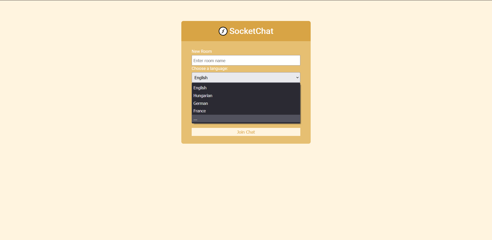

Funkcionális specifikáció
=========================

1. Jelenlegi helyzet leírása

    Az egyszerű, webes SocketChat appunkkal kapcsolatos feladatokat felosztottuk: Front-end (UI), Messaging, Back-end. Folyamatban van a
    design és a funkciók elhelyezésének/elérésének megbeszélése.

    ----------------

    Elkészült az első, bemutatásra szánt verzió. Meghatároztuk a 2.0 fontosabb funkcióit, hetekre bontott ütemtervet készítettünk. Felosztottuk a dokumentáció írás feladatait, az appot illető teendők felosztása folyamatban van.

2. Vágyálom rendszer leírása

    A SocketChat egy egyszerű, broadcast alapú, webes, valós idejű chat applikáció lesz. A felhasználót egy regisztrációs/bejelentkezési
    felület fogadja majd. Amennyiben korábban regisztrált (felhasználónév, jelszó) már az oldalon, akkor a belépést, ha nem, akkor pedig a
    bejelentkezést követően a szoftver át fogja irányítani a chat felületre. Itt megtekinthetőek lesznek az üzenetek és a felhasználók, a
    felület alján pedig a szövegbeviteli mező és a küldés gomb.

    ---------------

    A 2.0 verzió sok új funkciót fog tartalmazni, ilyenek a chat szobák is, melyeknek preferált nyelvet megadva jelezhetjük, hogy - ha bekapcsolva hagyjuk a funkciót - milyen nyelven szeretnénk olvasni a megjelenő üzeneteket.
    A beszélgetés utolsó állapota mindig tárolva lesz, így visszalépve a szobába ott folytathatjuk a beszélgetést, ahol abbahagytuk.
    Új design, személyre szabási beállítások teszik majd színesebbé a kezelőfelületet.

4. Jelenlegi üzleti folyamatok modellje.

    (v1.0)

    Napjainkban már mindenki a fejlett és híres chat alkalmazásokat használja, mint például Facebook Messenger, WhatsApp, Discord amelyek
    sok más funkciókkal is rendelkeznek a chatelelésen kívül. Egy vállalati környezeten belül tárgyalt információkat az ott dolgozó
    embereknek nem biztos, hogy biztonságos egy ilyen nyílt felületen megosztani egymás között valamint nem is biztos, hogy szükséges egy
    ennyire összetett felületet használni. Erre lehet jó egy egyszerű belső kommunikációra képes webalkalmazás.

    (v2.0)

    Annak érdekében hogy egy ilyen belső kommunikációra képes chat alkalmazás hatékonyabban használható legyen,
    szükség van olyan lehetőségekre, funkciókra az alkalmazáson belül amelyek lehetőség kínálnak mégtöbb üzleti folyamatra.
    Egy nagy fejlesztés az előző verzióhoz képest az hogy egy vállalaton belül akár a különböző szekcióknak külön chat szobái lehetnek így
    nem keverednek a témák a beszélgetés közben és mindenki megérti miről beszél a másik alkalmazott mivel ugyan azon a szekción belül
    dolgoznak. 
    Több szobára van szükség abban az esetben is ha vállalton belül az embereket a különböző pozíciójuk alapján különítjük el. Lehetőség
    van tehát hogy külön szobában beszélgessenek a kezdő alkalmazottak, tapasztalt alkalmazottak, szekció vezetők, igazgatók és
    igazgatóhelyettesek.
    A szobák törlésére illetve létrehozására lehetőség van viszont a jogosultság kezelés még nincs egyáltalán kidolgozva.
    Egy másik nagy fejlesztés az hogy az elküldött üzenetek tárolásra kerülnek az adatbázisban, ezért az üzenetek visszanézhetőek lesznek
    illetve megmaradnak kijelentkezés majd visszajelentkezés után is.
    Ezen kívül az alkalmazás új verziója felhasználóbarátabb lett mivel a felhasználó a chat felületen találkozik több gombbal is, amelyek
    a kijelentkezést/ bejelentkezést, fordítás kikapcsolását/ bekapcsolását teszik lehetővé valamint saját háttérszínt állíthat
    magának ami csak neki jelenik meg.
    Az új verzió helyesírás ellenőrzést is tartalmaz amely az alkalmazottak közötti gördülékeny kommunikációt segíti elő.
    A szobákat akár alapértelmezett nyelveik szerint is létrehozhatjuk mivel lehetőség van erre a beállításra is. Előfordul hogy egy cégen
    belül több nyelvet is beszélnek az alkalmazottak.
    Erre egy nagyon ötletes megoldás az automatikus szöveg fordítás lehetősége amely a chat felületén ki/be kapcsolható.
    Bekapcsolás esetén az alkalmazott minden, a szobán belül megjelenített üzenetet az adott szoba alapértelmezett nyelvén fog látni.
    Ha ez a funkció ki van kapcsolva akkor az adott felhasználó minden üzenetet pontosan ugyan úgy lát mint ahogyan azt a küldő megírta.

5. Igényelt üzleti folyamatok modellje.

    (v1.0)

    Ez a webalkalmazás egy lehetőség arra, hogy bárki fel tudja használni információ közlés céljából, magán célokra és minimális vagy akár
    valótlan adatok megadásával.

    (v2.0)

    Napjainkban a egy vállalaton belül nagyon komplex folyamatok mennek végbe nap mint nap ezért igény van minél nagyobb komplexitású alkalmazásokra amelyeket az adott vállalat maximálisan ki tud használni. Ilyen fejlesztésekkel láttuk el a mi alkalmazásunkat is, annak érdekében hogy használhatóbb legyen a vállalkozások számára.
    
6. Követelmény lista

    (v1.0)

    1. Szükséges lesz egy olyan oldalra, ahol a felhasználók tudnak fiókot létrehozni. Ehhez egy regisztrációs API-t, illetve egy frontend
    oldalt kell tervezni.
    2. Egy felhasználónév csak egyszer szerepeljen a rendszerben, tehát egyedinek kell lennie.
    3. A jelszónak is kellenének bizonyos megszorítások, mint például minimális hossz, szükséges karakterek (kis -és nagybetű, szám).
    Figyelni kell arra, hogy ezeket az adatokat a szerver oldalon is érvényesítsük.
    4.  A bizalmasabb információt, mint a jelszót titkosítva kell eltárolnunk (nem visszafejthetően, hashelve).
    5.  Az üzenetek ne kerüljenek tárolásra adatbázisban, csak az adott munkamenetben lehessen látni a mások által, illetve a felhasználó
    maga által küldött üzeneteit.
    6.  Belépés után a felhasználók tudjanak egymással valós időben kommunikálni, és lássák, hogy kik elérhetőek (felhasználónevüket).
    7.  Kilépés után már csak a többi, még csatlakozott felhasználónak látszódjanak az üzenetek, amit a kijelentkezett felhasználó küldött,
    illetve az adott felhasználót dobja vissza egy bejelentkező, vagy regisztrációs felületre.
    
    (v2.0)
    
    1. Szükség lesz új gombokra, amely lehetőséget biztosítanak a harmadik felek által üzemeltetett (általunk kiválasztott) bejelentkezésre.
    2. A fent említett bejelentkezéshez az adott platformon szükséges felhasználói fiók, így ezekre (a felhasználói adatokra) vonatkozó
    megszorításokat nem tudjuk biztosítani, rájuk hagyatkozunk.
    3. Ezen bejelentkezést használva nem kerül tárolásra jelszó, csak egy platform azonosító és felhasználónév.
    4. Az chat szobák adatai és ott elküldött üzenetek tárolásra kerülnek az adatbázisban, már nem csak az adott munkamenetben.
    5. Automatikus üzenetfordítás.
    6. Felhasználói felület személyre szabása háttér állításával, felhasználói beállítások nyújtása: automatikus fordítás be- és
    kikapcsolása.
    7. Chat szobák létrehozása.
    8. Chat szobák törlése.
    9. Szobák jogosultságainak kezelése ( ki a készítője, ki az, aki végrehajthat módosításokat a szoba beállításainál ).
    10. Alapértelmezett nyelv választása.

7. Használati esetek

    - A felhasználó az alábbi tevékenységeket végezheti:

        (v1.0)
        
        - Az oldalra regisztrálhat (Register) egy új felhasználónév és egy jelszó megadásával (register gomb).
        - Az oldalra bejelentkezhet(Login) egy már regisztrált felhasználónév és jelszó párossal (login gomb).
        - Regisztrálást követően a regisztrált felhasználóval be kell jelentkezni a chateléshez (login).
        - Bejelentkezést követően lehetőség van a kijelentkezésre (kijelentkezés gomb), ekkor a bejelentkezéshez lesz irányítva a
        felhasználó.
        - Bejelentkezést követően lehetőség van üzenetet írni az üzenet dobozra kattintva valamint küldésre a (Send gomb) lenyomásával.
        - A felhasználónak lehetősége van megtekinteni a jelenleg aktív felhasználókat.
        - A felhasználónak lehetősége van megtekinteni ki csatlakozott be/ki a beszélgetésbe.
        
       (v2.0)
       
        - Bejelentkezés után:
            - A létező chat szobák megjelenítése
            - Chat szobák törlése
                - Csak a saját maga által létrehozott szobákat tudja törölni
            - A chat szobák alapértelmezett nyelvének megjelenítése
            - Új chat szobák létrehozása, megadható alapértelmezett nyelvvel
            - Csatlakozás a létező chat szobákhoz
            - A chat szobában jelen lévő felhasználók megjelenítése
            - Elküldött üzenetek fordítása a szoba alapértelmezett nyelvére
            - Felhasználói beállítások
                - Háttér állítása
                - Az alkalmazás használata közben eltöltött idő és annak megjelenítése 
        
8. Megfeleltetés

    (v1.0)

    Regisztráció:
    - API és regisztrációs felület (registration form)
    - Felhasználónév:
        - Egyedinek kell lennie
    - Jelszó:
        - Minimum 6 karakteres, legalább 1 kis és nagy betűt kell tartalmaznia, illetve 1 számot.

    Bejelentkezés:
    - API és bejelentkező felület (login form)
    - Azonosítás tokenekkel történik, amelyek kijelentkezésig érvényesek.

    Kilépés:
    - Kilépés után a felhasználó nem látja ismét a kijelentkezés előtti állapotot (régebbi üzeneteket), nem tárolódnak adatbázisban.
    - Kilépés után visszadobja a bejelentkező felületre a felhasználót.

    Chat:
    - API és felület
    - Megjeleníti az aktív felhasználókat és üzeneteiket valós időben.

    (v2.0)
    
    Bejelentkezés:
    - Google, GitHub, Atlassian bejelentkező gomb.
    - Mivel a fent említett bejelentkezési lehetőségek használatával nem tároljuk el a jelszót, a felhasználónév pedig ezen külső, harmadik
    féltől származó API-ek adják vissza, ezeknek a validálására nincs szükség. A validálás az általuk biztosított regisztrációs folyamat
    során történik.
    
    Kilépés:
    - Kilépés és ismételt bejelentkezés után nem vesznek el az üzenetek, eltárolódnak az adatbázisban a szobához kapcsolódóan.
    
    Chat:
    - Szobákban történik a kommunikáció.
    - Külső API használata a fordítások eléréséhez .
    - Megjeleníti a felhasználók által küldött üzeneteket az alapértelmezett nyelvre lefordítva.

        
9. Képernyő tervek

    (v1.0)
    
    Egy olyan webes chat applikáció, ahol valós időben látjuk a résztvevők üzeneteit és neveit. Fontos része az applikációnak, hogy
    láthatóak legyenek az elérhető felhasználók, illetve ezeknek a megjelenítőknek változzon az állapota valós időben, amennyiben egy
    kliens csatlakozás, vagy kilépés történik.
    
    (v2.0)
    
    Az előző verzióhoz képest a bejelentkező illetve regisztráló felület egy kevés vizuális frissítést kapott. Nagyobb a betűméret illetve pár árnyékolás is megjelent.

    

    A "Register" fülön belül a megfelelő adatok megadásával regisztrálni lehet lásd:

    

    A regisztrált adatokat felhasználva a "Login" fülön belül lehetőség van bejelentkezni lásd:

    

    Teszt adatok:

    

    A bejelentkezés után a felhasználó át lesz irányítva a szoba kezelő felületre ahol lehetőség van szoba létrehozására, szoba alapértelmezett nyelvének beállítására valamint ki lehet választani hogy melyik, már létrehozott szobába szeretnénk csatlakozni.

    

    Később bővülnek majd a nyelvek.

    

    Az általunk létrehozott szoba is ide kerül majd be.

    

    A szoba kiválasztása után a csatlakozás gomb átirányítja a felhasználót chat felületre.

    

    Ezen a felületen megjelenik majd minden, a szobával kapcsolatos információ valamint olyan gombok amelyek valamilyen funkcionalitás alkalmazását teszik lehetővé.

10. Forgatókönyvek

    (v1.0)

    Ha egy felhasználó meglátogatja a weboldalt, lehetősége van regisztrálni, vagy bejelentkezni.
    
    Amennyiben a regisztrációt választja, megfelelő felhasználónév és jelszó választása után létrehozhatja a fiókját.
    
    Amennyiben a felhasználó be szeretne jelentkezni, megfelelő felhasználónév és jelszó használatával ezt megteheti a bejelentkezési
    felületen.
    
    Bejelentkezés után láthatóvá válik a chat felület, ahol tud kommunikálni (üzenetet küldeni) a többi, aktív felhasználóval.
    
    Az új, bejelentkezett felhasználó aktív státusszal látható lesz a többi résztvevő számára.
    
    Üzenet küldése után megjelenik minden fél számára az üzenet, szinte azonnal.
    
    Kijelentkezésnél a felhasználó eltűnik az aktív felhasználók listájáról.
    
    (v2.0)
    
    A weboldal meglátogatása után megjelenik a bejelentkező felület, amely már nem csak felhasználónév és jelszó párossal engedi a
    rendszerbe való belépést, hanem már a Google, GitHub és Atlassian fiókjával (harmadik felektől származó fiókok).
    
    Bejelentkezés után egy kezelőfelület fogadja a felhasználót.
    
    A kezelőfelületen lehetősége van egy opció kiválasztására több közül.
    
        1. Az egyik opció, egy már létező chat szobába való becsatlakozás.
        2. A másik opció egy új chat szoba létrehozás.
    
    Amennyiben a felhasználó be szeretne csatlakozni egy már létező szobába, a csatlakozás gombra kattintva ez a folyamat megtörténik és
    addig tartózkodik a szobában, amíg vagy ki nem jelentkezik / bezárja a weboldalt, vagy kilép a szobából való kilépésre szolgáló
    gombbal
    (kilépés a szobából).
    
    Ellenkező esetben, ha új szobát szeretne létrehozni, a szoba nevének megadása után a "Létrehozás" gombra kattintva teheti meg. Egy
    szoba addig létezik, amíg törlése nem kerül. Létrehozás után nem kerül be automatikusan a szobába, explicit módon kell az előző
    pontban
    történő leírás alapján csatlakozni.
    
    A felhasználónak a kezelő felületen kívül megjelenik egy gomb amely egy tetszőleges háttér beállítása, amellyel tudja személyre
    szabni a felületét. A háttér állítása során csak annak a felhasználónak változik a háttere, amelyik végrehajtotta a folyamatot, a
    többi felhasználónál nem történik változás (ezért is személyre szabás).
    
    Egy szobába való csatlakozás után lehetőség lesz a szoba törlésére, egy arra szolgáló gombbal. Fontos megjegyezni, hogy csak az tudja
    a
    szobát törölni, aki létrehozta az adott szobát.
    
    A szobának beállításai is vannak, mint például alapértelmezett nyelv állítása. Ez az a nyelv, amelyre az üzenetek alapértelmezetten
    lefordításra kerülnek, ha egy felhasználó más nyelven küldené az üzenetét. A fordított szöveg minden felhasználónak láthatóvá válik a
    szobában.
    
    Kijelentkezés után az üzenetek nem vesznek el, mivel a szobák üzenetei az adatbázisban tárolásra kerülnek, így ismételt belépés után
    láthatóvá válnak az előzőleg elküldött üzenetek.

    

11. Funkció – követelmény megfeleltetés

    A regisztrációhoz és bejelentkezéshez egy közös HTML (+CSS) lap készül, itt egy kattintással dönthet majd a felhasználó, hogy melyiket
    kívánja használni. A felhasználónévre és jelszóra vonatkozó megszorítások megsértéséről egy - a regisztrációs/bejelentkezési blokk
    alatt megjelenő - üzenet fogja informálni a felhasználót (ahogy a regisztráció sikerességéről is). HTML (+CSS) lap készül az üzenetek
    megjelenítésére is, itt lesz lehetőség üzenetet küldeni és megtekinteni, valamint listázni az elérhető felhasználókat.

    A 2.0 verzióban a bejelentkezési lehetőségek kibővített listája miatt a meglévő oldal három gombbal egészül ki: Bejelentkezés Google fiókkal, Bejelentkezés Atlassain fiókkal, Bejelentkezés GitHub fiókkal. 

    A chat szobák kialakítása miatt szükség lesz egy másik oldalra is, ahol az ide kapcsolódó funkciók érhetők el (bejelentkezés után a szerver ide irányítja át a felhasználót). Egy szövegbeviteli mezőbe írva adhatjuk meg az új szoba nevét, mellette egy DropDownList elemei közül választhatunk preferált nyelvet. Ha nem szeretnénk új szobát létrehozni, akkor kapcsolódhatunk meglévőhöz is, itt is DropDownList segítségével megy a kiválasztás.

    A chat felületen látható lesz az aktuális szoba neve, alatta pedig a felhasználók listája. Jobb oldalon az üzenetek (küldő, küldés ideje, üzenet), alul pedig egy szövegbeviteli mező lesz (ide írhatjuk az elküldeni kívánt üzenetet) egy küldés gombbal; valamint a jobb felső sarokban egy kijelentkezés és szoba elhagyása gombbal.

    A személyre szabási lehetőségek részeként bekerülő ColorPicker segítségével választhatunk majd háttérszínt.

12. Fogalomszótár

    Regisztráció: Az a folyamat, mely során a felhasználó adatai megadásával új fiókot tud létrehozni.

    Bejelentkezés: Az a folyamat, mely során a felhasználó be tud lépni adataival a saját fiókjába, amit előzőleg létrehozott.

    Kijelentkezés: Az a folyamat, mely során a felhasználó ki tud lépni a saját fiókjából, majd visszakerül a bejelentkezéshez.

    Üzenet: A közlendő információ.

    Üzenet küldés: A közlendő információ publikálása.

    Szoba alapértelmezett nyelve: A szoba létrehozásánál megadható hogy fordítás esetén milyen nyelvre legyenek lefordítva az üzenetek az
    adott szobában.

    Chat Szoba: Egy elkülönített légkör amelyben lehetőség van üzeneteket küldeni. Csak az látja illetve csak az írhat üzeneteket az adott
    szobába aki be van csatlakozva. (csatlakozást igényel)

    Új szoba létrehozása: Új szoba létrehozása esetén meg kell adni a szoba nyelvét illetve nevét majd ennek hatására bővül a szobák
    listája.

    Csatlakozás: Adott szoba kiválasztása után a csatlakozás gomb után kerül a felhasználó a szobába.

    Kilépés: Az a folyamat, mely során a felhasználó ki tud lépni az adott szobából majd ezután a szoba kezelő felületre lesz átirányítva.

    Helyesírásellenőrző: Ellenőriz minden a szobában leírt szót, majd jelzi hogy ha valamelyik hibásan/ helytelenül lett leírva.

    Háttérszín változtatás: A felhasználó egy beállított színű hátteret fog látni a szobán belül. (a többi felhasználó ebből semmit nem
    lát) 
